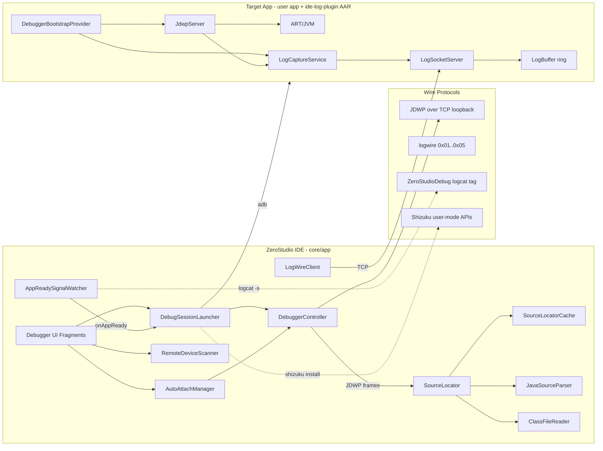
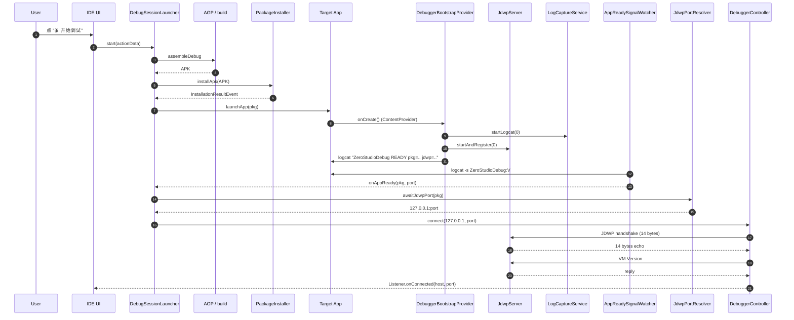
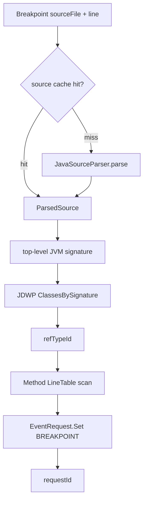
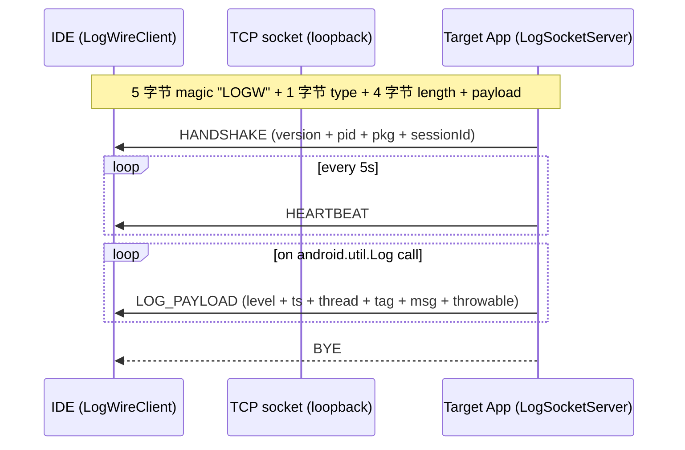

# ZeroStudio IDE Debugger 架构

> Phase F2 — 整体架构图 (Mermaid)。覆盖 IDE ↔ 目标应用 (target app) 的
> 端到端流程、模块边界与数据流。

## 1. 顶层视图

## 2. 启动一次 debug session 的完整流程

## 3. Source location 解析路径

## 4. logwire 协议消息流

## 5. 模块清单

| 模块 | 路径 | 角色 |
|------|------|------|
| `core/app` | `core/app/src/main/java/com/itsaky/androidide/debugger/` | IDE 端 — UI/launcher/attach |
| `ide-debugger` | `ide-debugger/src/main/java/com/zerostudio/debugger/` | IDE 端 — JDWP client + SourceLocator |
| `utilities/logwire` | `utilities/logwire/src/main/java/com/itsaky/androidide/logwire/` | 协议 — 帧编解码 + 客户端骨架 |
| `ide-log-plugin` | `ide-log-plugin/src/main/java/com/zerostudio/logplugin/` | 目标端 — JDWP server + log capture |
| `tooling/plugin` | `tooling/plugin/src/main/java/com/itsaky/androidide/gradle/` | 构建端 — AGP 注入 |

## 6. 线程模型

| 模块 | 线程 | 备注 |
|------|------|------|
| DebugSessionLauncher | bgExecutor | 不在 UI 线程跑 build/install/launch |
| AutoAttachManager | mainHandler | 1.5s 防抖后切到 probe worker |
| JdwpClient | 单一 reader 线程 + worker pool | reader 收包;worker 解析 |
| LogWireClient | 单一 reader 线程 | callbacks 在 reader 线程派发 |
| LogSocketServer | accept thread + heartbeat executor | accept + 5s 周期心跳 |
| JdwpServer | accept + per-connection handler | 一连接一线程 |

## 7. 错误恢复策略

| 失败阶段 | 行为 | UI 反馈 |
|----------|------|---------|
| Build | 立刻 fail(Step.BUILD) | FlashBar "构建失败" |
| Install | 60s timeout, fail(Step.INSTALL) | FlashBar + logcat 链接 |
| Launch | fail(Step.LAUNCH) | Toast |
| Resolve port | runAs probe fallback, fail(Step.RESOLVE_PORT) | FlashBar "请确认 app 已就绪" |
| Connect | DebuggerController.connect throws | 红色 snackbar |

## 8. 安全考虑

- 所有 JDWP / logwire 流量绑定 loopback (`127.0.0.1`)。
- 远程连接走 Shizuku，UID 验证后才允许 adb。
- 帧头 magic `LOGW` 校验失败立即断开。
- 协议版本不匹配时 `Handshake.read` 抛 `IllegalArgumentException`。
